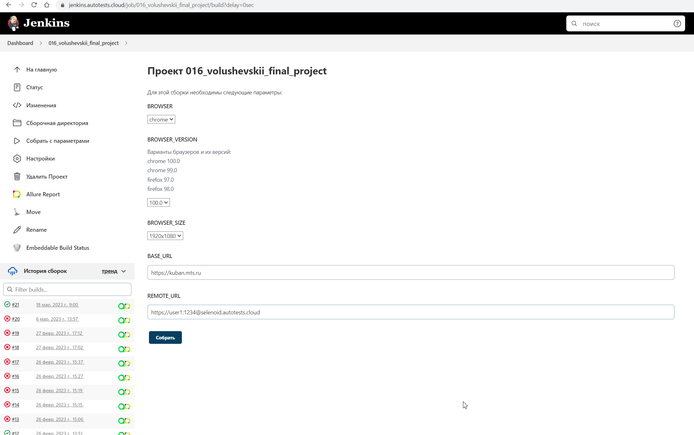
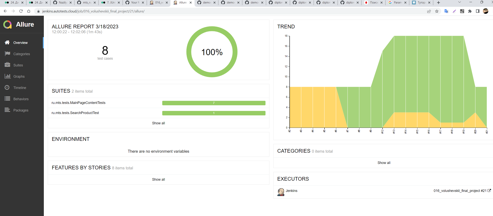
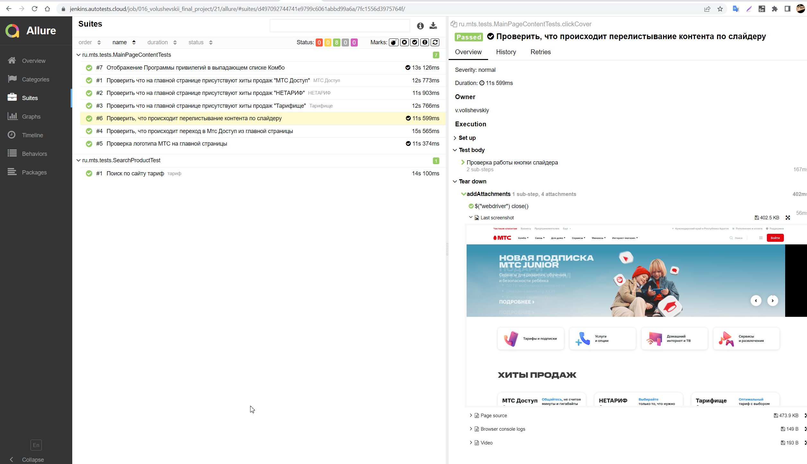
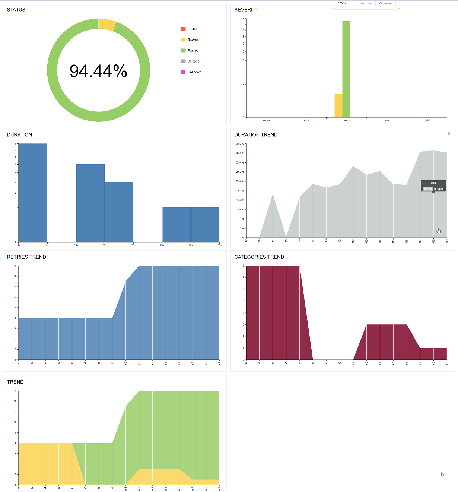
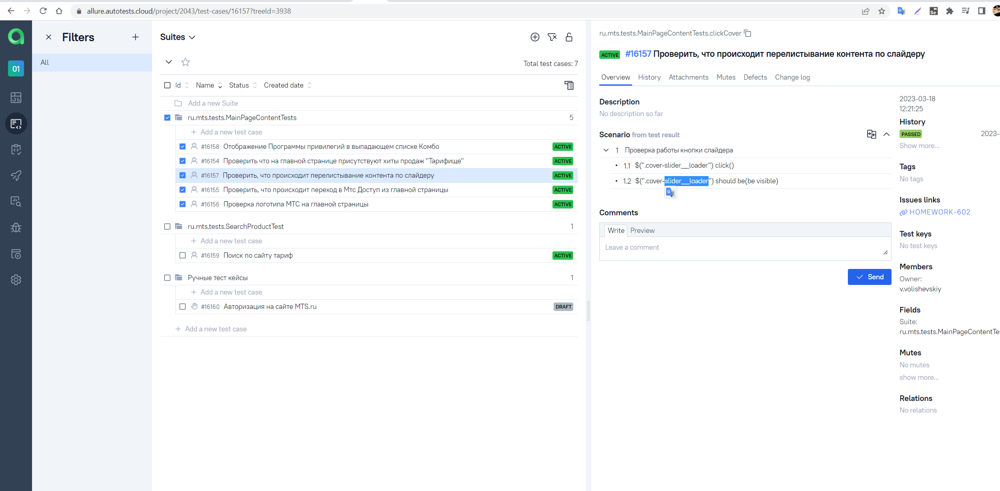
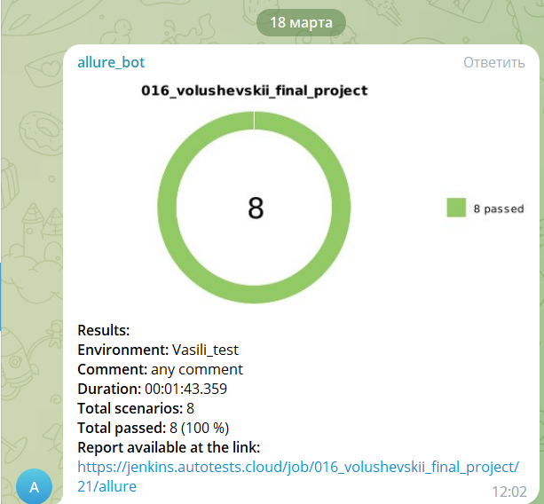
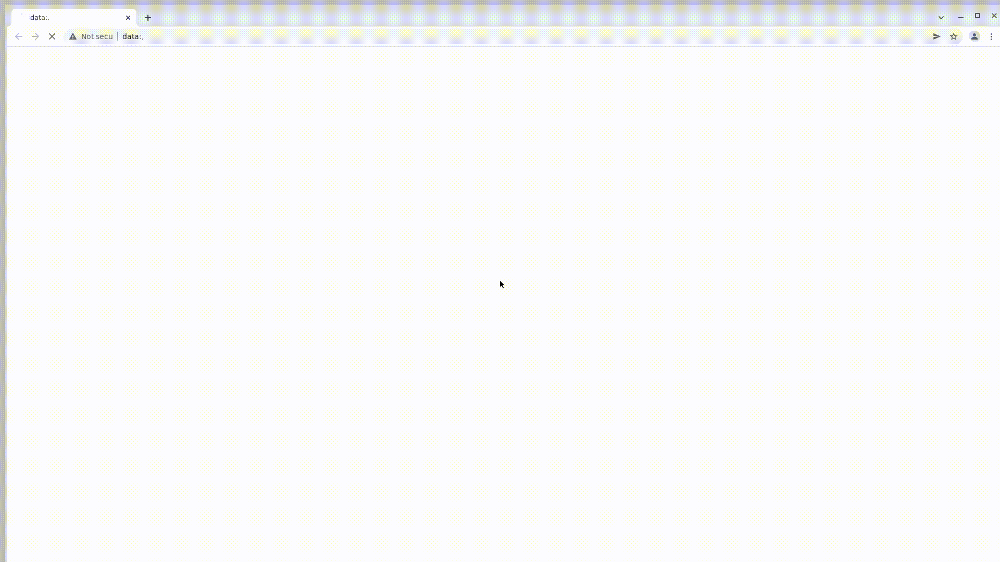
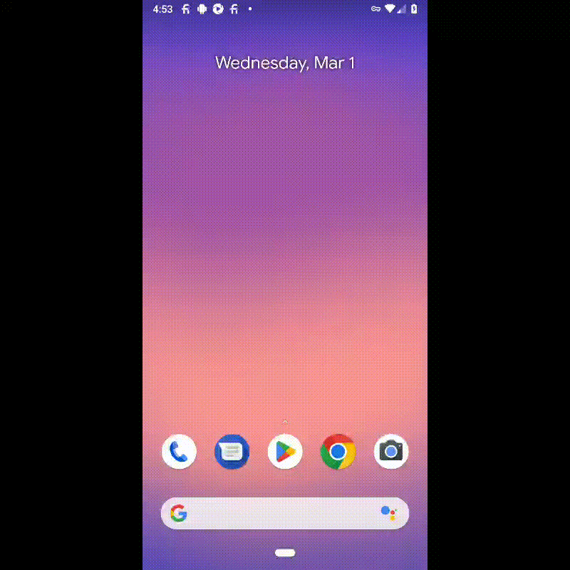
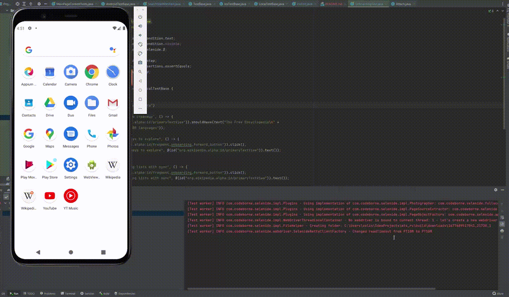

# Дипломный проект по автоматизации тестирования web, api и mobile платформ

## 	Содержание

> ➠ [Общая информация о проекте](#общая-информация-о-проекте)
>
> ➠ [Запуск тестов из терминала](#запуск-тестов-из-терминала)
>
> ➠ [Запуск тестов в Jenkins](#-удаленный-запуск-тестов-в-Jenkins)
>
> ➠ [Отчет о результатах тестирования в Allure Report](#-главная-страница-allure-отчета)
>
> ➠ [Тест кейсы в Allure Test Ops](#-тест-кейсы-в-allure-test-ops)
>
> ➠ [Уведомления в Telegram с использованием бота](#-уведомления-в-telegram-с-использованием-бота)
>
> ➠ [Web сайт MTS.RU](#MTS.RU)
>
> ➠ [Покрытый функционал web приложения MTS](#покрытый-функционал-web-приложения-mts)
>
> ➠ [Технологический стек UI](#технологический-стек-ui)
>
> ➠ [Пример запуска теста в Selenoid](#-пример-запуска-теста-в-selenoid)
>
> ➠ [Api сервис REQRES.IN](#api-сервис-reqres)
>
> ➠ [Покрытый функционал api сервиса REQRES.IN](#покрытый-функционал-api-сервиса-reqres)
>
> ➠ [Технологический стек API](#технологический-стек-api)
>
> ➠ [Мобильное приложение Ozon](#мобильное-приложение-ozon)
>
> ➠ [Тестирование мобилльного приоложения с использованием сервиса Browserstack](#покрытый-функционал-мобильного-приложения)
>
> ➠ [Технологический стек Mobile](#технологический-стек-mobile)
>
> ➠ [Пример запуска теста в Browserstack](#-пример-запуска-теста-в-browserstack)
>
> ➠ [Пример запуска теста в AndroidStudio](#-пример-запуска-теста-в-AndroidStudio)

##  Общая информация о проекте

### Запуск тестов из терминала

### Локальный запуск тестов

#### Локальный запуск тестов с использованием параметров из property файла

```
gradle clean test -Denv={имя property файла в папке test.resources}
```

#### Локальный запуск тестов с использованием параметров из property файла test

```
gradle clean test
```

#### Описание параметров для запуска тестов

>
> -Dbrowser <code>название браузера</code>
>
> -DbrowserVersion  <code>версия браузера</code>
>
> -DbaseUrl <code>url стенда фронта</code>
>
> -DbrowserSize <code>разрешение браузера</code>
>
> -DwebRemoteUrl <code>url remote сервиса</code>
>
> -DapiBaseUrl <code>url для запуска api тестов</code>
>
> -DappIos <code>IOS идентификатор приложения, загруженного в browserstack </code>
>
> -DdeviceIos <code>название девайса IOS </code>
>
> -Dos_versionIos <code>версия ОС </code>
>
> -DappAndroid <code>Android идентификатор приложения, загруженного в browserstack </code>
>
> -DdeviceAndroid <code>название девайса Android </code>
>
> -Dos_versionAndroid <code>версия ОС </code>
>
> -Durl <code>url стенда browserstack</code>
>


### Удаленный запуск тестов

#### Удалённый запуск через передачу параметров

```
gradle clean test 
-DwebRemoteUrl="${REMOTE_URL}"
-Dbrowser="${BROWSER}"
-DbrowserVersion="${BROWSER_VERSION}"
-DbrowserSize="${BROWSER_SIZE}"
-DbaseUrl="${BASE_URL}"
-DapiBaseUrl="${API_URL}"
-DdeviceAndroid="${ANDROID_DEVICE}"
-Dos_versionAndroid="${ANDROID_VERSION}"
-DdeviceIos="${IOS_DEVICE}"
-Dos_versionIos="${IOS_VERSION}"
-Dusername="${USER_NAME}"
-Dpassword="${PASSWORD}"
-DappIos="${APP_IOS}"
-DappAndroid="${APP_ANDROID}"
-Durl="${URL}"
```


##  Удаленный запуск тестов в Jenkins

> Для запуска тестов используется параметризированная сборка

<p align="center">

</p>

##  Главная страница allure отчета

<p align="center">

</p>

###  Группировка тестов по проверяемому функционалу

<p align="center">

</p>

###  Основной дашборд

<p align="center">

</p>

###  Тест кейсы в Allure Test Ops

<p align="center">

</p>

##  Уведомления в Telegram с использованием бота

> После завершения сборки специальный бот, созданный в <code>Telegram</code>, автоматически обрабатывает и отправляет сообщение с отчетом о прогоне.
>
> Информация по настройке и использованию бота <code>https://github.com/qa-guru/allure-notifications</code>

<p align="center">

</p>

##  Web сайта MTS.RU

###  Покрытый функционал web приложения MTS

> Разработаны автотесты на <code>UI</code>.
### UI

- [x] Работоспобность главной страницы и отображение отдельных блоков
- [x] Работу выподающего списка "Комбо"
- [x] Переход в "МТС Доступ"
- [x] Работоспобность слайдера на главной странице

### Технологический стек UI

<p align="center">


</p>

### В данном подпроекте автотесты написаны на <code>Java</code> с использованием <code>Selenide</code> для UI-тестов.
>
> <code>Selenoid</code> выполняет запуск браузеров в контейнерах <code>Docker</code>.
>
> <code>Allure Report</code> формирует отчет о запуске тестов.
>
> Для автоматизированной сборки проекта используется <code>Gradle</code>.
>
> В качестве библиотеки для модульного тестирования используется <code>JUnit 5</code>.
>
> <code>Jenkins</code> выполняет запуск тестов.
>
> После завершения прогона отправляются уведомления с помощью бота в <code>Telegram</code>.

##  Пример запуска теста в Selenoid

> К каждому тесту в отчете прилагается видео. Одно из таких видео представлено ниже.

<p align="center">

</p>

##  Api сервис REQRES.IN

###  Покрытый функционал api сервиса

> Разработаны автотесты на <code>Api сервис</code>.
### Api

- [x] Получение списка пользователей
- [x] Проверка наличия пользователя
- [x] Создание пользователя
- [x] Обновление пользователя
- [x] Регистрация пользователя
- [x] Проверка id и email пользователя
- [x] Проверка email пользователя с помощью Groovy


### Технологический стек API

<p align="center">


</p>

### В данном подпроекте автотесты написаны на <code>Java</code> с использованием <code>Rest Assured</code> для Api-тестов.
>
> <code>Rest Assured</code> выполняет роль обёртки над http клиентом.
>
> <code>Allure Report</code> формирует отчет о запуске тестов.
>
> Для автоматизированной сборки проекта используется <code>Gradle</code>.
>
> В качестве библиотеки для модульного тестирования используется <code>JUnit 5</code>.
>
> <code>Jenkins</code> выполняет запуск тестов.
>
> После завершения прогона отправляются уведомления с помощью бота в <code>Telegram</code>.

## Тестирование мобилльного приоложения с использованием сервиса Browserstack


> Разработаны автотесты для мобильного приложения

- [x] Проверка поиска в приложение Wikipedia
- [x] Проверка поиска на IOS

## Локальное тестирование мобилльного приоложения Wikipedia с использованием Android studio
- [x] Прохождение онбординга
### Технологический стек Mobile

<p align="center">


</p>

### В данном подпроекте автотесты написаны на <code>Java</code> с использованием <code>Selenide и Appium</code>.
>
> <code>Selenide и Appium</code> используются для управления мобильным устройством с помощью веб драйвера.
>
> В проверках есть локальный тест( запускается с помощью Android studio и эмулятора мобильного устройства), так и с помощью сервиса Browserstack, предоставляющего доступ к ферме с реальными мобильными устройствами
>
> <code>Allure Report</code> формирует отчет о запуске тестов.
>
> Для автоматизированной сборки проекта используется <code>Gradle</code>.
>
> В качестве библиотеки для модульного тестирования используется <code>JUnit 5</code>.
>
> <code>Jenkins</code> выполняет запуск тестов.
>
> После завершения прогона отправляются уведомления с помощью бота в <code>Telegram</code>.

##  Пример запуска теста в Browserstack

> К каждому тесту в отчете прилагается видео и различные логи. Одно из таких видео представлено ниже.

<p align="center">

</p>

##  Пример запуска теста в AndroidStudio

<p align="center">

</p>
